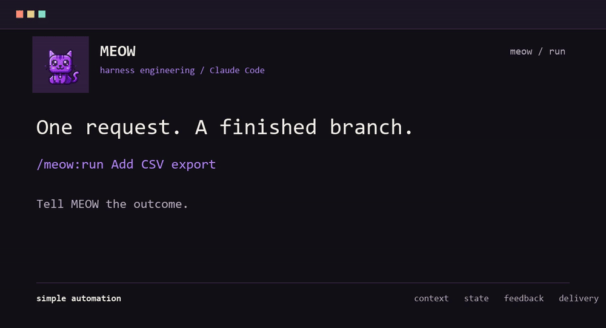
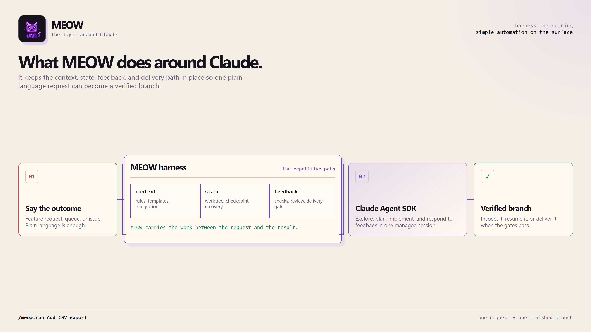

# MEOW

[](https://github.com/maya8237/MEOW/actions/workflows/ci.yml)
[](https://www.python.org/downloads/)

<p align="center">
  
</p>

> Tell MEOW what you want. Get the finished branch.

MEOW makes software delivery simple. Set up a project once, describe the work
in plain language, and let MEOW take the repetitive software-delivery work off
your plate until a finished, verified branch is ready.

Under the hood, reusable templates and [Claude Agent SDK](https://docs.claude.com/en/api/agent-sdk/)
sessions handle setup, planning, implementation, tests, review, and delivery.
You do not have to babysit every phase: give MEOW a request, a queue of tasks,
or a Jira issue and it keeps moving toward a done deal. It pauses only when a
real product decision or permission boundary needs your input.

In harness engineering terms, MEOW is the layer around Claude: it supplies the
right context, templates, worktree, state, checks, recovery, and delivery path.
You get the simple part—one request in, one finished branch out.

Install it in one paste:

```bash
claude plugin marketplace add maya8237/MEOW && claude plugin install meow@meow
```

Try it first:

```text
/meow:onboard
/meow:run Add CSV export
```

## One command. Done.

Tell MEOW what you want. It does all the work and gives you the finished branch.





The demo shows what happens after one simple `/meow:run` command: MEOW carries
the work through to a verified branch.

## How it works

```text
1. Set up once           /meow:onboard
2. Say what you want     /meow:run Add CSV export
3. Get the finished branch
```

From a terminal, the same workflow is:

```bash
meow run "Add CSV export" --name csv-export
```

MEOW inspects the project, creates an isolated worktree, plans and implements
the change, runs the configured checks, reviews the result, and leaves a
finished branch or a resumable checkpoint. You provide the outcome you want;
MEOW handles the repetitive path to get there. Built-in defaults let you start
without learning the configuration system first.

## Why MEOW

MEOW is for developers and teams who want to state the outcome once instead of
operating another workflow system around every feature.

- **Configure once.** Project rules, checks, model settings, integrations, and
  worktree setup live in reusable configuration and templates.
- **Hand off repetitive work.** Give MEOW a feature request, queued task, or
  issue instead of manually coordinating setup, coding, checks, and review.
- **Use automation with a harness.** Claude Agent SDK sessions explore, plan,
  implement, test, review, and fix the change inside MEOW's repeatable delivery
  path.
- **Engineer the harness once.** Project templates, context, worktrees,
  checkpoints, checks, review, and delivery boundaries stay ready for the next
  request.
- **Stay hands-off safely.** Runs use isolated worktrees and explicit quality
  gates instead of editing the user's checkout blindly.
- **Recover instead of restarting.** Checkpoints, logs, plans, reviews, and
  evidence make interrupted work inspectable and resumable.
- **Use it anywhere.** Start from Claude Code, a terminal, CI, or an operating
  system scheduler.

## Install

### Install the Claude Code plugin

In a Claude Code session, add the MEOW marketplace once and install the plugin:

```text
/plugin marketplace add maya8237/MEOW
/plugin install meow@meow
```

From a shell, use the equivalent commands:

```bash
claude plugin marketplace add maya8237/MEOW
claude plugin install meow@meow
```

Verify the plugin is available:

```bash
claude plugin list
```

You should see `meow@meow` in the installed plugins.

### Install the MEOW CLI

The plugin provides the `/meow:*` skills. Install the Python package as well
to run the checkpointed CLI workflow:

```bash
# Python 3.12+
python -m pip install "git+https://github.com/maya8237/MEOW.git"
```

For a local checkout or contributor setup:

```bash
python -m venv .venv

# Windows
.venv\Scripts\python -m pip install -e .

# macOS or Linux
.venv/bin/python -m pip install -e .
```

### Use a LiteLLM Claude proxy

MEOW also supports LiteLLM Claude proxies through the Claude Agent SDK. Point
the SDK at your proxy, choose a model configured in LiteLLM, and run the same
one-command workflow:

```bash
export ANTHROPIC_BASE_URL="http://localhost:4000"
export ANTHROPIC_AUTH_TOKEN="sk-your-litellm-key"
export ANTHROPIC_MODEL="your-litellm-model"

meow run "Add CSV export" --name csv-export
```

On Windows PowerShell:

```powershell
$env:ANTHROPIC_BASE_URL = "http://localhost:4000"
$env:ANTHROPIC_AUTH_TOKEN = "sk-your-litellm-key"
$env:ANTHROPIC_MODEL = "your-litellm-model"

meow run "Add CSV export" --name csv-export
```

The proxy changes where the Claude Agent SDK sends model requests; MEOW's
templates, worktrees, checkpoints, checks, review, and delivery flow stay the
same. Keep proxy keys in environment variables or ignored local configuration.

## Try it in 60 seconds

From the repository where you want to use MEOW:

```text
/meow:onboard
```

Onboarding detects the project, configures the shared `.meow/` workflow, and
offers optional integrations and verification features. Then start a feature:

```text
/meow:run Add CSV export
```

Or run the same workflow from a terminal:

```bash
meow run "Add CSV export" --name csv-export
```

When it finishes, MEOW leaves the plan, checks, review, and branch state ready
for inspection or delivery. You do not need to run separate commands for each
phase.

## Examples

### Queue several tasks

Add work while MEOW is idle or while another run is active:

```bash
meow queue "Add CSV export"
meow queue "Add dark mode"
meow queue "Upgrade the API client"
meow queue
```

The repository-scoped worker processes the queue in order. A failed task pauses
the queue for inspection and retry instead of silently moving on.

### Solve a Jira issue

```bash
meow run --jira PROJ-123
```

MEOW fetches the issue, creates its worktree and branch, runs the same
plan/implement/test/review loop, and pushes the passing branch when delivery is
configured.

### Run in the background

```bash
meow run "Upgrade the API client" --name api-client --unattended --background

meow status RUN_ID
```

If the run is interrupted, continue it from its saved state:

```bash
meow resume RUN_ID --continue
```

## What MEOW automates

| You provide | MEOW handles | You get |
| --- | --- | --- |
| One feature request | Project understanding, planning, implementation, checks, and review | A verified branch or checkpoint |
| A queue of requests | Persistent FIFO processing and safe pause/retry | Repeatable background work |
| A Jira issue | Issue fetching, worktree setup, execution, verification, and delivery | A pushed issue branch and machine-readable result |

## The harness behind the automation

This is MEOW's harness engineering loop in plain English: the automation feels
simple because MEOW keeps the context, state, safety boundaries, feedback, and
delivery around Claude.

```text
request or issue -> project template -> Claude Agent SDK ->
isolated worktree -> checks and review -> verified branch
```

`meow run` coordinates the loop and keeps its state in a run checkpoint. The
normal path is:

1. Inspect the repository and project guidance.
2. Write a plan and Sprint Contract.
3. Implement in a retained worktree.
4. Run the configured quality gates.
5. Review the change independently and fix findings within the round budget.
6. Finalize the verified branch, or leave the checkpoint and evidence ready for
   inspection or resume.

## Claude Code skills

Each skill is available with the `meow` namespace:

| Skill | Use it when you want to... |
| --- | --- |
| `/meow:run` | Plan, implement, verify, review, and optionally deliver a feature. |
| `/meow:plan` | Write a plan and Sprint Contract without changing application code. |
| `/meow:review` | Review a prompt, plan, branch diff, Jira issue, GitLab or GitHub remote change, or existing review; optionally fix findings. |
| `/meow:lint` | Run the current project's configured linters and fix their findings in the active session. |
| `/meow:onboard` | Set up MEOW configuration, ignore rules, project checks, and optional integrations. |
| `/meow:migration` | Convert a legacy MEOW layout to the current structure. |
| `/meow:customize` | Decide where to add a skill, agent, MCP tool, or workflow behavior. |

## CLI essentials

Use the CLI for scripts, CI, scheduled work, or a fully headless run:

| Command | What it does |
| --- | --- |
| `meow run "<feature>" --name "<name>"` | Plan, implement, verify, and review a feature. |
| `meow plan "<feature>" --name "<name>"` | Write a plan without implementing it. |
| `meow review` | Review a plan or code diff; add `--fix` to loop on findings. |
| `meow run --jira [ISSUE-KEY]` | Solve a configured Jira issue in its own worktree. |
| `meow review --gitlab "<MR-URL>"` | Review a GitLab merge request read-only. |
| `meow review --github "<PR-URL>"` | Review a GitHub pull request read-only. |
| `meow run --lint-fix` | Run configured linters and fix remaining findings. |
| `meow status` / `meow resume` | Inspect or continue a saved run. |

All commands accept `--working-dir PATH`. See the [CLI guide](docs/CLI.md) for
worktrees, plan approval, background runs, testing, recovery, and advanced
options.

## Configuration

MEOW works with built-in defaults, so you can start with `/meow:onboard` and
add only the project behavior you need.

- `.meow/config.toml` contains shareable project settings.
- `.meow/config.local.toml` contains ignored machine- or user-specific values.
- `~/.meow/config.toml` is the user fallback.

Values resolve from local project config, to shared project config, to the user
fallback, and finally to built-in defaults. Keep credentials in the environment
or ignored local configuration; never commit secrets to the shared file. The
[example configuration](templates/meow-config.toml.example) shows lint,
testing, model, and integration settings.

## Integrations

MEOW can extend the same plan/implement/review loop to the systems your team
already uses:

- **Jira:** fetch an issue and build it in a retained branch with
  `meow run --jira`.
- **GitLab:** review a merge request with `meow review --gitlab`.
- **GitHub:** review a pull request with `meow review --github`.
- **LiteLLM:** route Claude Agent SDK requests through a Claude-compatible
  LiteLLM proxy with `ANTHROPIC_BASE_URL`, `ANTHROPIC_AUTH_TOKEN`, and
  `ANTHROPIC_MODEL`.
- **Testing:** run project tests, development servers, and optional browser
  flows with `--test`.
- **Claude Code hooks:** inspect and install optional lint hooks with
  `meow hooks`.
- **Scheduling:** run Jira automation from your operating system scheduler or
  CI; MEOW keeps the run log and result visible.

See the [integration guide](docs/INTEGRATIONS.md) for configuration, security
notes, scheduled runs, and troubleshooting.

## Documentation

- [CLI guide](docs/CLI.md): command options, execution modes, recovery, and
  testing.
- [Integration guide](docs/INTEGRATIONS.md): Jira, GitLab, GitHub, scheduled runs, and
  error reference.
- [Architecture](ARCHITECTURE.md): workflow, module responsibilities, and
  agent contracts.
- [Project instructions](AGENTS.md): repository-specific development rules.
- [Contributing](CONTRIBUTING.md): development setup and pull request guidance.
- [Roadmap](docs/ROADMAP.md): shipped work and the next simple handoffs.
- [Changelog](CHANGELOG.md): notable project changes.
- [License](LICENSE): MIT License.

## Development

```bash
python -m pip install -e ".[dev]"
python -m pytest -q
ruff check
```

If MEOW saves you time, [star the repository](https://github.com/maya8237/MEOW)
and open an issue with the workflow you would like to see next.

